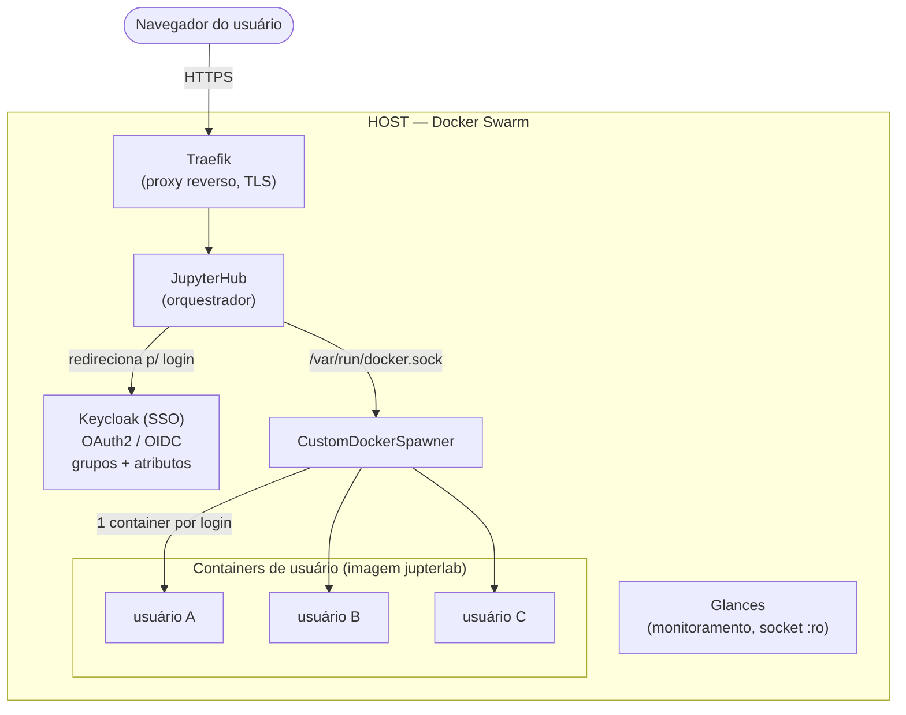

# LAPIG JupyterHub — Plataforma de Ciência de Dados Geoespacial

Infraestrutura multiusuário de JupyterHub voltada para Ciência de Dados e Geoprocessamento, mantida pelo LAPIG/UFG. Integra **JupyterHub**, **DockerSpawner**, **Keycloak (SSO)**, **Traefik** e monitoramento via **Glances**, sobre uma arquitetura **Docker-out-of-Docker (DooD)** orquestrada por **Docker Swarm**.

Cada usuário autenticado recebe um container isolado com um ambiente completo de geoprocessamento (Python + R + QGIS + GDAL), provisionado dinamicamente no login e destruído ao encerrar a sessão. Autorização, limites de recurso (CPU/RAM) e papel de administrador são gerenciados **centralmente no Keycloak**, sem arquivos de configuração locais por usuário.

---

## Sumário

- [Arquitetura](#arquitetura)
- [Duas imagens Docker, dois propósitos](#duas-imagens-docker-dois-propósitos)
- [Estrutura do repositório](#estrutura-do-repositório)
- [Pré-requisitos](#pré-requisitos)
- [Configuração do Keycloak](#configuração-do-keycloak)
- [Configuração do ambiente](#configuração-do-ambiente)
- [Subindo o ambiente](#subindo-o-ambiente)
- [Fluxo de inclusão de novos usuários](#fluxo-de-inclusão-de-novos-usuários)
- [Como os limites de recurso chegam ao container](#como-os-limites-de-recurso-chegam-ao-container)
- [Operação e troubleshooting](#operação-e-troubleshooting)
- [Segurança](#segurança)

---

## Arquitetura

O núcleo da infraestrutura é o modelo **DooD (Docker-out-of-Docker)**: o container do JupyterHub monta o socket do Docker do host (`/var/run/docker.sock`), o que permite ao `DockerSpawner` criar e gerenciar containers de usuário diretamente no host — como containers **irmãos**, não aninhados.

Toda a stack roda sobre **Docker Swarm** (`docker stack deploy`), e não `docker compose` puro. Isso é uma exigência do ambiente: o Traefik está configurado com o provider Swarm (`--providers.swarm`), então só enxerga serviços publicados como objetos Swarm. Containers criados via `docker compose up` seriam invisíveis para o roteamento.



**Fluxo de login:** o navegador chega ao Traefik via HTTPS, que roteia ao JupyterHub. O Hub redireciona ao Keycloak para autenticação; o token retorna com o grupo do usuário e os atributos de limite (`mem_limit` / `cpu_limit`). Com base nisso, o `CustomDockerSpawner` cria o container do usuário no host (via socket Docker) e ajusta as permissões do volume de trabalho.

### Componentes

| Componente | Papel |
|---|---|
| **Traefik** | Proxy reverso externo; roteia requisições HTTPS até o container do Hub via labels Docker (declaradas em `deploy.labels`, exigência do Swarm). Termina o TLS (Let's Encrypt via `certresolver`) e conversa com o Hub em HTTP interno. Não faz parte deste repositório — é uma dependência externa que precisa estar rodando e conectado à mesma rede overlay. |
| **JupyterHub** | Orquestrador central. Autentica via Keycloak, lê autorização (grupo), papel de admin e limites de recurso diretamente do token OAuth (`auth_state`), e delega ao `CustomDockerSpawner` a criação do container de cada usuário. |
| **Keycloak (SSO)** | Provedor de identidade via OAuth2/OIDC (`GenericOAuthenticator`). **Fonte única de verdade** para: quem pode acessar (grupo `jupyterhub2_users`), quem é admin (grupo `lapig-admin`) e os limites de CPU/RAM de cada usuário (atributos `mem_limit_jupyterhub2` / `cpu_limit_jupyterhub2`). |
| **CustomDockerSpawner** | Subclasse do `DockerSpawner` (definida em `jupyterhub_config.py`). Além de instanciar um container por usuário, ajusta a posse do diretório do usuário para `1000:100` **depois** que o container está de pé, via API Docker — resolvendo a condição de corrida do bind mount. |
| **Glances** | Dashboard web de monitoramento de recursos do host (CPU, memória, containers). Roda com `pid: host` e acesso somente-leitura ao socket Docker. |

---

## Duas imagens Docker, dois propósitos

Este projeto builda **duas imagens distintas**, cada uma com um Dockerfile próprio — não confundir uma com a outra:

| | `docker/Dockerfile.hub` | `jupyterlab/docker/Dockerfile` |
|---|---|---|
| **O que builda** | A imagem do **próprio JupyterHub** (o orquestrador) | A imagem de **ambiente de trabalho** entregue a cada usuário |
| **Base** | `quay.io/jupyterhub/jupyterhub:5.3.0` | `quay.io/jupyter/datascience-notebook` (multi-stage) |
| **Quem "roda" essa imagem** | Um único serviço: o `jupyterhub` do stack | Um container por usuário logado, criado sob demanda pelo DockerSpawner |
| **Onde é referenciada** | `image: lapig/geojupyterhub:v1` no `docker-compose.yml` | `DOCKER_NOTEBOOK_IMAGE` no `.env`, consumida pelo DockerSpawner |

Em outras palavras: uma imagem é o **motor** (Hub), a outra é o **posto de trabalho** (Lab) que o motor distribui a cada usuário.

> ⚠️ A tag Docker da imagem de ambiente é publicada como `lapig/jupterlab` (sem o "y" de "Jupyter") — grafia intencional, mantida por compatibilidade com as tags já publicadas no Docker Hub. Digitar `lapig/jupyterlab` (com "y") aponta para uma imagem inexistente e o spawn falha com `pull access denied`.

A imagem de ambiente do usuário é build multi-stage e tem documentação própria — arquitetura dos estágios, pacotes R via `install.R`, fluxo de build/publish e troubleshooting: **[`jupyterlab/README.md`](jupyterlab/README.md)**.

---

## Estrutura do repositório

```
jupyterhub/
├── docker/
│   ├── docker-compose.yml      # Stack Swarm: jupyterhub + glances + rede overlay externa
│   └── Dockerfile.hub          # Imagem do orquestrador JupyterHub
├── jupyterlab/
│   └── docker/
│       ├── Dockerfile          # Imagem de ambiente (Python + R + Geo) entregue a cada usuário
│       └── script/
│           └── install.R       # Pacotes R instalados no build multi-stage
├── local_tests/                # Pasta de testes locais/experimentais
├── scripts/
│   └── jupyterhub_config.py    # Configuração do Hub: OAuth, CustomDockerSpawner, autorização
├── var/
│   └── db/
│       ├── jupyterhub_cookie_secret
│       └── jupyterhub.sqlite   # Banco de estado interno do Hub (sessões, spawns)
├── .env                        # Variáveis de ambiente (não versionado)
├── .env.example                # Template de referência para o .env
├── .python-version
├── pyproject.toml              # Dependências do tooling Python do repositório, via uv
└── README.md
```

> **Diretório de dados dos usuários** — os arquivos de trabalho de cada usuário ficam em `/home/lapig/applications/storage/jupyterhub/users/<username>` no host, montado como `/work` dentro do container. O diretório é criado automaticamente no primeiro spawn e não precisa ser provisionado manualmente. O volume compartilhado `shared/` (montado em `/work/shared`) fica em `/home/lapig/applications/storage/jupyterhub/shared`.

> **`local_tests/`** é uma pasta de testes locais e não faz parte do fluxo de deploy documentado aqui.

> **Não há mais `users.json`.** Quotas, autorização e papel de admin migraram inteiramente para o Keycloak — ver [Configuração do Keycloak](#configuração-do-keycloak). Se você encontrar referências a `data/users.json` ou `generate_ufolder.sh` em versões antigas, elas estão obsoletas.

---

## Pré-requisitos

- Docker Engine em modo **Swarm** (`docker swarm init`, se ainda não inicializado)
- Uma rede Docker **overlay** externa já criada (o Swarm exige overlay, não `bridge`, para redes compartilhadas entre serviços do stack):
  ```bash
  docker network create --driver overlay --attachable <sua-rede-overlay>
  ```
- Traefik já rodando como serviço Swarm, **conectado a essa mesma rede overlay**, e configurado para resolver o `certresolver` referenciado nas labels (`le`, no exemplo — normalmente Let's Encrypt)
- Um realm Keycloak configurado conforme a seção abaixo (client OAuth2, grupos e atributos)
- [`uv`](https://docs.astral.sh/uv/) instalado, caso vá trabalhar no tooling Python do repositório (`pyproject.toml` / `.python-version`)

---

## Configuração do Keycloak

O Keycloak é a fonte única de verdade para acesso e limites. Esta configuração é feita **uma vez** no realm; depois dela, incluir um novo usuário é só preencher atributos (ver [Fluxo de inclusão de novos usuários](#fluxo-de-inclusão-de-novos-usuários)).

### 1. Client OAuth2

Crie um client (ex.: `jupyterhub2`) no realm, com:

- **Client authentication**: On (client confidencial — gera o `client_secret`)
- **Standard flow**: habilitado (Authorization Code Flow)
- **Valid redirect URIs**: `https://sci2.lapig.iesa.ufg.br/hub/oauth_callback`
- **Web origins**: `https://sci2.lapig.iesa.ufg.br`

### 2. Grupos

- `jupyterhub2_users` — **obrigatório**. Só quem pertence a este grupo consegue autenticar no Hub. Grupo, por si só, não restringe acesso a client no Keycloak; a restrição é aplicada pelo `allowed_groups` do JupyterHub, que lê o claim `groups` do token.
- `lapig-admin` — membros deste grupo recebem papel de administrador no JupyterHub (via `admin_groups`).

### 3. Atributos de usuário (limites de recurso)

Em **Realm settings → User profile → Attributes**, declare dois atributos (com "Create attribute"):

- `mem_limit_jupyterhub2` — limite de memória (ex.: `2G`, `4G`)
- `cpu_limit_jupyterhub2` — limite de CPU em núcleos (ex.: `1`, `2`)

Recomenda-se permissão de **view/edit apenas para Admin** — o usuário não deve editar o próprio limite.

### 4. Client Scopes e Mappers

Para que os atributos e grupos apareçam no token, crie os client scopes com seus mappers e associe-os ao client `jupyterhub2` como **Default**:

| Client Scope | Mapper (tipo) | `user.attribute` | `claim.name` (nome no token) |
|---|---|---|---|
| `mem-limit-jupyterhub2` | User Attribute | `mem_limit_jupyterhub2` | `mem_limit` |
| `cpu-limit-jupyterhub2` | User Attribute | `cpu_limit_jupyterhub2` | `cpu_limit` |
| `groups` | Group Membership | — | `groups` |
| `jupyterhub2-roles` | User Realm Role | — | `roles` |

> ⚠️ **Ponto de atenção crítico:** no mapper *User Attribute*, o campo `user.attribute` deve casar **exatamente** com o nome do atributo declarado no User Profile (`mem_limit_jupyterhub2`, com "y" e com sufixo). O `claim.name` é independente e pode ser um nome mais limpo (`mem_limit`) — é ele que o `jupyterhub_config.py` lê. Divergência entre os dois faz o claim vir vazio no token, silenciosamente.

Para validar sem precisar logar: **Clients → jupyterhub2 → Client scopes → Evaluate**, selecione um usuário e veja o **Generated access token** — os campos `mem_limit`, `cpu_limit`, `groups` e `roles` devem aparecer.

---

## Configuração do ambiente

Copie o template e preencha com os valores do seu ambiente:

```bash
cp .env.example .env
```

Variáveis esperadas em `.env` (confira `.env.example` para a lista exata do seu setup):

```env
# Rede interna do Hub
JUPYTERHUB_BIND_URL=http://0.0.0.0:443

# OAuth2 / Keycloak  (use https:// — o realm precisa bater com o do client)
OAUTH_CLIENT_ID=jupyterhub2
OAUTH_CLIENT_SECRET=<gerado_no_keycloak>
OAUTH_CALLBACK_URL=https://sci2.lapig.iesa.ufg.br/hub/oauth_callback
OAUTH_AUTHORIZE_URL=https://<seu-keycloak>/realms/<realm>/protocol/openid-connect/auth
OAUTH_TOKEN_URL=https://<seu-keycloak>/realms/<realm>/protocol/openid-connect/token

# Criptografia do auth_state — OBRIGATÓRIO
# O JupyterHub exige esta chave para armazenar o auth_state (que carrega
# os claims do Keycloak). Gere com: openssl rand -hex 32
JUPYTERHUB_CRYPT_KEY=<64_caracteres_hex>

# Infraestrutura Docker
DOCKER_NETWORK_NAME=<sua-rede-overlay>
DOCKER_NOTEBOOK_IMAGE=lapig/jupterlab:v3.0.8
SPAWNER_START_TIMEOUT=300
SPAWNER_HTTP_TIMEOUT=300
```

> ⚠️ **Cuidado ao anexar variáveis com `echo >>`.** Se o `.env` não terminar com uma quebra de linha, `echo "VAR=x" >> .env` cola a nova variável no fim da última linha existente, corrompendo ambas. Confirme com `tail -c 50 .env | xxd` que cada variável está em sua própria linha.

> ⚠️ **Coerência `http` vs `https` e realm correto.** As três URLs de OAuth devem usar `https` (o Keycloak em produção recusa o fluxo em `http`) e apontar para o **realm do client**, não para `master`. Um `redirect_uri` ou realm divergente resulta em "Parâmetro inválido: redirect_uri" ou falha de autenticação.

> ⚠️ **Nunca commite o `.env` preenchido.** `OAUTH_CLIENT_SECRET` e `JUPYTERHUB_CRYPT_KEY` são credenciais sensíveis — se vazarem, rotacione-as (no Keycloak e via novo `openssl rand`, respectivamente).

---

## Subindo o ambiente

Na maior parte do tempo, **você não precisa buildar as imagens localmente** — ambas costumam já ter uma versão publicada no Docker Hub, e o deploy (ou o próprio DockerSpawner) simplesmente puxa a tag configurada. Buildar do zero só é necessário quando alguma das imagens for alterada — ver [Publicando uma nova versão de imagem](#publicando-uma-nova-versão-de-imagem) mais abaixo.

### Uso normal — subir a infraestrutura

Como a stack roda em Swarm, o comando é `docker stack deploy` (a partir da pasta `docker/`, onde está o `docker-compose.yml`):

```bash
cd docker/
docker stack deploy -c docker-compose.yml jupyterhub-sci2
```

Isso puxa (ou reaproveita, se já local) as imagens configuradas em `docker-compose.yml` (`lapig/geojupyterhub:v1`) e `.env` (`DOCKER_NOTEBOOK_IMAGE`), e inicializa os serviços `jupyterhub` e `glances` na rede overlay. O Hub é iniciado com:

```bash
jupyterhub -f /srv/jupyterhub/scripts/jupyterhub_config.py
```

O uso explícito de `-f` garante que o Hub carregue a configuração deste repositório (mapeada via volume de `../scripts`) em vez de cair em um `jupyterhub_config.py` genérico.

**Verificar status:**

```bash
docker service ls | grep jupyterhub
docker service logs jupyterhub-sci2_jupyterhub -f
```

> **Aplicando mudanças no `.env` ou no `jupyterhub_config.py`.** O Swarm nem sempre detecta que só o conteúdo de um `env_file` ou de um arquivo montado mudou. Para forçar a recriação do serviço:
> ```bash
> docker service update --force jupyterhub-sci2_jupyterhub
> ```
> Se ainda assim a variável nova não aparecer dentro do container (confira com `docker exec <container> env | grep VAR`), remova e recrie o serviço:
> ```bash
> docker service rm jupyterhub-sci2_jupyterhub
> docker stack deploy -c docker-compose.yml jupyterhub-sci2
> ```

---

### Publicando uma nova versão de imagem

Use este fluxo sempre que alterar o `Dockerfile.hub` do Hub. Para a imagem de ambiente do usuário (`jupterlab`), veja o fluxo de build/publish dedicado em [`jupyterlab/README.md`](jupyterlab/README.md#build-e-publicação).

> ⚠️ **Lembre sempre de trocar o número da versão** (a tag `vX.Y.Z`) antes de buildar e publicar — sobrescrever uma tag já em uso pode quebrar sessões de usuários que ainda estão referenciando a imagem antiga.

**Imagem do JupyterHub (orquestrador)** — a partir de `docker/` (onde fica `Dockerfile.hub`):

```bash
cd docker/

docker build -t lapig/geojupyterhub:v1 . -f Dockerfile.hub

docker login

docker push lapig/geojupyterhub:v1
```

Depois de publicar, atualize o campo `image:` do serviço `jupyterhub` em `docker-compose.yml` para a nova tag, e rode `docker stack deploy -c docker-compose.yml jupyterhub-sci2` novamente para aplicar.

---

## Fluxo de inclusão de novos usuários

Com a migração para o Keycloak, incluir um usuário é feito **inteiramente no Keycloak** — sem editar arquivos no repositório, sem rodar scripts no host e sem reiniciar o Hub.

| Passo | Local | Ação |
|---|---|---|
| **1. Credenciais** | Keycloak → Users | Cadastrar o usuário (garantir **e-mail preenchido** — ver nota abaixo). |
| **2. Acesso** | Keycloak → Users → Groups | Associar ao grupo `jupyterhub2_users`. **Sem isso, o login retorna 403.** |
| **3. Limites** | Keycloak → Users → (atributos) | Preencher `mem_limit_jupyterhub2` (ex.: `2G`) e `cpu_limit_jupyterhub2` (ex.: `1`). |
| **4. Admin (opcional)** | Keycloak → Users → Groups | Se o usuário for administrador, associar também ao grupo `lapig-admin`. |
| **5. Login** | Navegador | O usuário acessa a URL pública, autentica via SSO. No primeiro spawn, o diretório de trabalho é criado e a permissão ajustada automaticamente. |

Não é preciso reiniciar o Hub: a autorização e os limites são lidos do token a cada login.

> ⚠️ **E-mail obrigatório.** O realm tem a required action `VERIFY_PROFILE` ativa. Se o usuário não tiver e-mail preenchido, o fluxo de login trava na verificação de perfil e pode manifestar-se como `expired_code` nos eventos do Keycloak. Preencha o e-mail no cadastro para evitar isso.

---

## Como os limites de recurso chegam ao container

Vale entender a cadeia completa, porque cada elo precisa estar alinhado (é onde a maioria dos problemas de configuração aparece):

1. **Atributo declarado** no User Profile do realm (`mem_limit_jupyterhub2`).
2. **Valor preenchido** no usuário (ex.: `4G`).
3. **Mapper** (`User Attribute`) expõe o atributo no token, com `claim.name = mem_limit`.
4. **Token** chega ao JupyterHub no login. Com `enable_auth_state = True` e `userdata_from_id_token = True`, os claims ficam em `spawner.user.auth_state['oauth_user']`.
5. **`pre_spawn_hook`** (async) lê `auth_state['oauth_user']['mem_limit']` e aplica em `spawner.mem_limit` / `spawner.cpu_limit`, com fallback para os defaults de `.env` quando o claim está ausente.

Se um limite não estiver sendo aplicado, verifique a cadeia de trás para frente — o **Evaluate → Generated access token** do client é o ponto mais rápido para ver se o claim está de fato saindo no token.

### Ajuste automático de permissões

O `DockerSpawner` padrão cria o container e monta os volumes, mas os diretórios criados pelo bind mount ficam com dono `root:root`, o que impede o usuário `jovyan` (UID 1000) de escrever. Ajustar isso no `pre_spawn_hook` não funciona: o hook roda **antes** do container existir, e o Docker recria o diretório como root depois.

A solução é a subclasse `CustomDockerSpawner`, que sobrescreve `start()`: ela chama `super().start()` (que só retorna com o container já de pé) e então executa um `chown -R 1000:100 /work /home/jovyan/.ssh` **dentro do container**, via API Docker (`exec_create`/`exec_start`) — não via CLI `docker`, que não está instalado na imagem do Hub. O volume compartilhado `shared/` é deixado intacto de propósito.

---

## Operação e troubleshooting

**Logs do Hub em tempo real:**
```bash
docker service logs jupyterhub-sci2_jupyterhub -f
```

**Logs do container de um usuário específico:**
```bash
docker logs jupyter-<username>
```

**Confirmar que uma variável do `.env` chegou ao container do Hub:**
```bash
docker exec $(docker ps -q --filter "name=jupyterhub-sci2_jupyterhub") env | grep <VAR>
```

**Container de usuário "fantasma" com config antiga** — com `c.DockerSpawner.remove = False`, o container do usuário persiste entre spawns, então mudanças em volumes/rede/imagem só valem para containers **novos**. Se um usuário não está pegando a config atualizada, remova o container dele e deixe recriar no próximo login:
```bash
docker rm -f jupyter-<username>
```

**Eventos de autenticação do Keycloak** — para diagnosticar 403, `redirect_uri` inválido, `expired_code`, etc., habilite **Realm settings → Events** e consulte o log de eventos do realm.

**Verificar se uma tag da imagem de ambiente existe no Docker Hub sem baixá-la:**
```bash
docker manifest inspect lapig/jupterlab:v3.0.8
```

**Monitoramento de recursos do host:** acesse `http://<IP_do_servidor>:9011` (porta mapeada para o Glances no `docker-compose.yml`).

---

## Segurança

- O socket Docker (`/var/run/docker.sock`) é montado **com permissão de escrita** no container do JupyterHub — necessário para o DockerSpawner criar containers, mas isso equivale, na prática, a acesso root ao host. Trate a configuração do Hub (`scripts/jupyterhub_config.py`) com o mesmo rigor de um script rodando como root.
- O Glances monta o mesmo socket em modo **somente-leitura** (`:ro`) — não reduza esse escopo sem necessidade.
- **Acesso e limites vivem no Keycloak.** A restrição de quem entra (`jupyterhub2_users`), quem é admin (`lapig-admin`) e as quotas de recurso são gerenciadas centralmente no realm. Remover um usuário do grupo, ou desabilitá-lo no Keycloak, corta o acesso no próximo login.
- Segredos (`OAUTH_CLIENT_SECRET`, `JUPYTERHUB_CRYPT_KEY` e outros) vivem exclusivamente em `.env`, que **não deve ser versionado**. Confirme que `.env` está no `.gitignore` e nunca cole seu conteúdo em issues, PRs ou logs compartilhados.
- O `auth_state` é criptografado em repouso com `JUPYTERHUB_CRYPT_KEY`. Perder essa chave invalida os `auth_state` já armazenados (os usuários simplesmente reautenticam); trocá-la é uma operação segura, mas exige recriar o serviço.